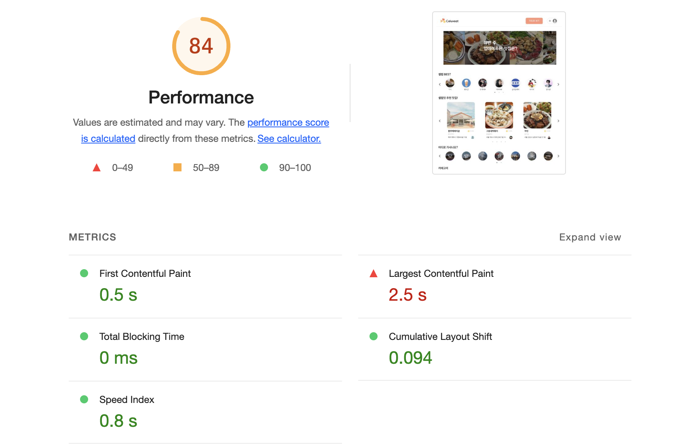
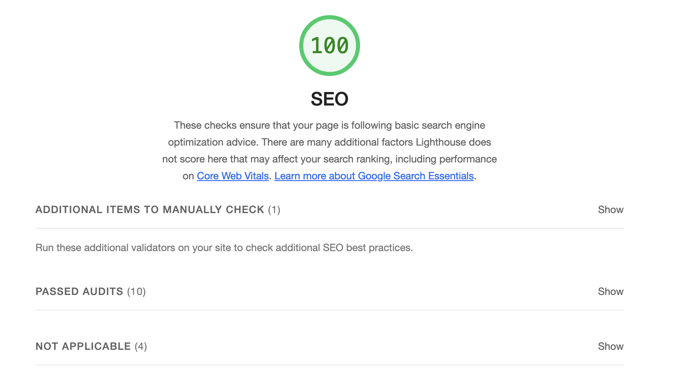
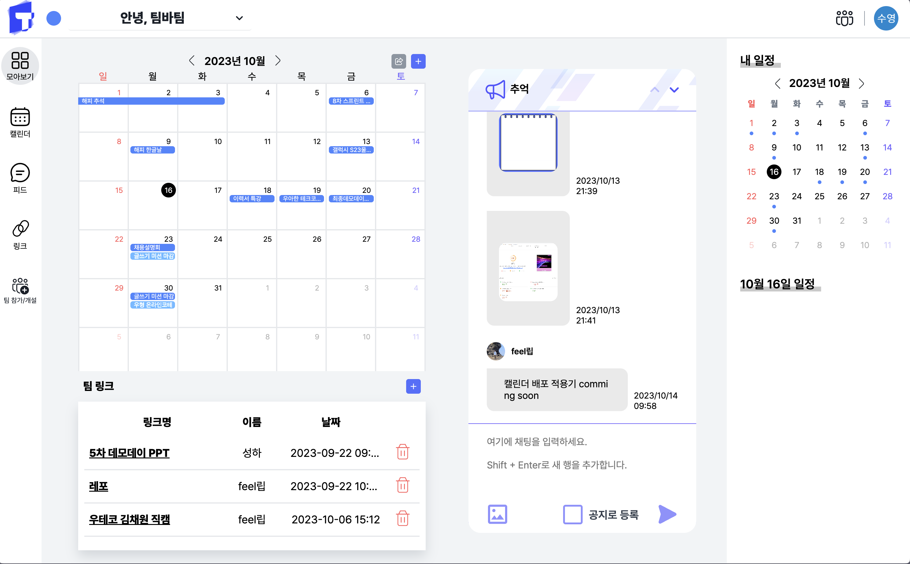
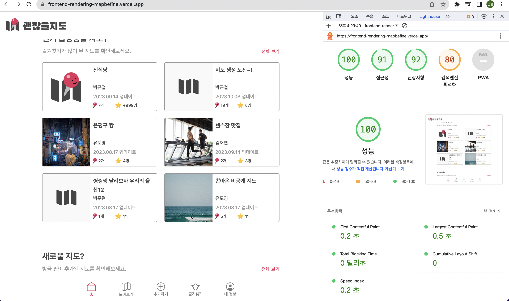

## 🚀 2단계 - 렌더링 방식 토론

### 🎯 2단계 - 렌더링 방식 탐구 및 비교 분석

## 렌더링 시점의 비교

### SPA
- 처음 웹을 로딩할 때만 서버로부터  html, css, javascript 등 모든 정보를 가져오고, 이후 데이터만 동적으로 업데이트한다.
- 새로운 데이터가 필요할 때는 Ajax와 같은 API로 서버로부터 JSON 형식으로 전달 받아 브라우저에서 페이지를 동적으로 렌더링 한다.
- 서버가 한 페이지를 처음부터 다시 만드는 것이 아닌, 동적인 데이터만 JS가 동작하면서 API로부터 받은 정보로 업데이트한다.

### SSR
- 서버에서 페이지를 렌더링해서 클라이언트에 전달해주는 방식이다.
- 버튼 클릭에 대한 핸들러 또는 API 요청이 필요한 요소의 경우에는 JavaScript가 다 다운되고 나서 완성된다.
- 처음 유저한테 컨텐츠가 보이기 시작하는 시간 자체가 짧아져 좋은 사용자 경험을 제공할 수 있다.
- 또한 모든 컨텐츠가 HTML에 담겨오기 때문에 효율적인 SEO가 가능하다.

### SSG
- 웹 사이트의 모든 페이지를 미리 렌더링하고 클라이언트의 요청에 따라 페이지를 제공하는 방법이다.
- 빌드 시점에 페이지를 미리 생성해두는 것이다.
- SSR이 가진 장점을 모두 가진다.하지만 HTML 문서에 변경 사항이 있다면 프로젝트를 다시 빌드해야 한다.

### ISR
- SSR과 SSG를 혼합한 렌더링 방식이다. 
- SSG 방식처럼 빌드 시에 HTML 문서를 렌더링한다. 하지만 설정한 시간 이후에 들어온 요청에 대해서는 SSR 방식처럼 새로운 HTMl 문서를 렌더링해서 응답한다.
- SSG와 다르게 페이지에 변경 사항이 있어도 프로젝트를 다시 빌드할 필요가 없다. 하지만 SSR처럼 요청마다 페이지를 생성하는 것이 아니기 때문에, 실시간 데이터를 보여줘야하는 페이지에는 적합하지 않다.

## 사용자 경험(UX) 측면 분석
### CSR
#### 장점
- CSR은 서버를 호출할 때마다 전체 UI를 다시 로드할 필요가 없다.
- 클라이언트 측 라우팅으로 인해 페이지 간 전환이 부드럽게 이루어진다.
#### 단점
- 초기 html이 빈 페이지로 오기 때문에 검색 엔진 최적화에 어려움이 있을 수 있다.
- 초기 페이지 로딩 후 데이터를 가져와야 하므로 초기 로딩 후 대기 시간이 발생할 수 있다.

### 서비스 실제 적용 사례 -> 괜찮을지도 실제 서비스

- 초기 html이 빈 페이지로 오는 것을 볼 수 있다.

- 클라이언트 측 라우팅으로 인해 깜빡임 없이 페이지 간 전환이 부드럽다. 또한 전체 UI를 다시 로드하지 않는 것을 볼 수 있다. 

### SSR
#### 장점
- 사용자가 페이지를 열면 모든 데이터가 존재하므로 대기 시간이 감소된다.
#### 단점
- 많은 동시 요청을 처리하는 서버에 부하를 줄 수 있다.

### SSG

#### 장점
- 모든 페이지가 미리 렌더링 되므로 초기 로딩이 빠르다.
- 서버는 정적 파일을 서빙하므로 부하가 낮다.
#### 단점
- 페이지 갱신을 위해서는 재빌드가 필요하다. 동적 데이터 업데이트에 어려움이 있다.

### 서비스 실제 적용 사례 -> 괜찮을지도 클론 서비스

- 서버는 정적 파일을 서빙한 것을 볼 수 있다. 또한 이처럼 페이지가 미리 렌더링 되므로 초기 로딩이 빠르게 되어 사용자 경험이 좋아진다.

### ISR
#### 장점
- 빠른 초기 페이지 로딩 및 빠른 업데이트 가능하다.
- SSG의 장점을 유지하면서 동적 데이터 업데이트가 가능하다.
#### 단점
- 주기적으로 업데이트가 되기는하지만 여전히 실시간으로 변하는 데이터를 반영할 수 없다.

## 성능 측정 및 비교
- 실제 사이트

- 클론 사이트

LCP에서 가장 크게 차이가 나는데, 2.4초(SPA)보다 약 5배 적은 0.5초(SSG)로 줄었다. 
SEO는 SSG가 높게 나오나 큰 차이는 없는걸 볼 수 있다.