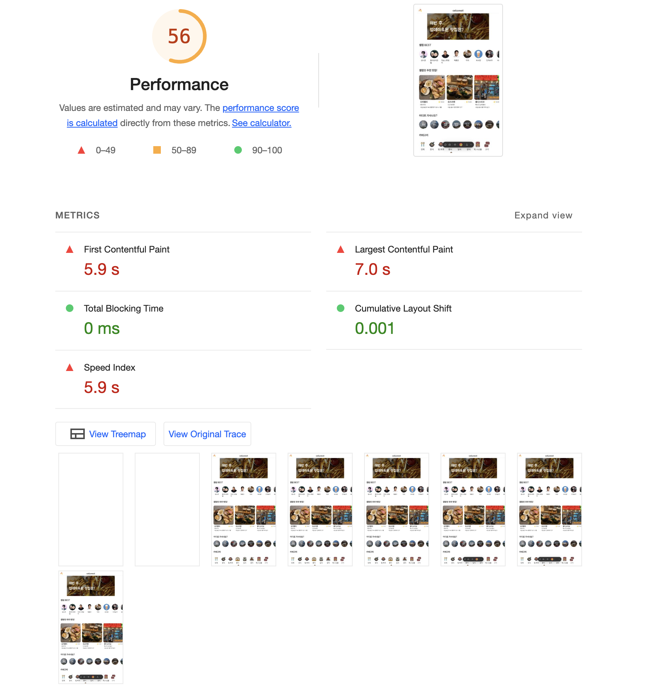

# 📑 렌더링 방식 분석 리포트 - 유스

## 📊 렌더링 시점의 비교

### SPA

- 페이지의 뼈대 HTML만 서버에 의해 렌더링됩니다.
- 컨텐츠를 표시하는데 사용되는 로직, 데이터 페칭, 라우팅 등은 클라이언트의 JS 코드가 처리합니다.
- HTML이 제자리에서 업데이트되며, 새로 고치지 않아도 업데이트된 정보를 표시할 수 있습니다.
- 네트워크 요청으로 인해 웹 크롤러가 해석하는데 시간이 걸리므로 기본적으로 SEO 친화적이지 않습니다.

### SSR

- 사용자 요청에 대한 응답으로 렌더링할 페이지 전체의 HTML을 생성합니다.
- 데이터 페칭, HTML 생성이 모두 서버에서 이뤄지므로 클라이언트에서 렌더링 관련 코드가 필요하지 않습니다.
- 따라서 JS를 클라이언트로 전송할 필요가 없습니다.
- 웹 크롤러가 컨텐츠를 쉽게 크롤링할 수 있어 SEO 친화적입니다.

### SSG

- 빌드 시점에 HTML이 생성됩니다.
- 생성된 HTML은 각 요청에 재사용되고, CDN에 캐시도 가능합니다.
- 컨텐츠가 이미 존재하고, 웹 크롤러가 추가 작업 없이 렌더링 가능하므로 SEO 친화적입니다.

### ISR

- SSG 방식과 마찬가지로 빌드 시점에 HTML이 생성됩니다.
- SSG와 마찬가지로 생성된 HTML은 재사용되고, CDN에 캐시도 가능합니다.
- 데이터를 주기적으로 갱신하여 동적인 컨텐츠를 보여주는데 한계가 있는 SSG의 단점을 보완합니다.

---

## 🧑🏻‍💻 UX 측면 분석

- 팀바팀 서비스의 페이지 대부분은 인터랙션이 존재합니다.
- 인터랙션으로 인해 자주 동적으로 바뀌는 컨텐츠를 보여주기 위해서는 기존의 SPA 방식이 적합합니다.
  
- 서버 사이드 렌더링을 통해 UX를 개선하기 위해서는 '랜딩 페이지'와 같이 사용자에게 맞춤 설정할 필요가 없는 컨텐츠를 SSG로 렌더링하는 것이 적합합니다.
  

---

## 📊 성능 측정 및 비교

- Lighthouse를 사용하여 측정했습니다.

- Next.js로 SSG 방식을 사용한 페이지는 폰트를 최적화하지 않았음에도 성능 점수가 비슷했습니다.
  - 폰트를 최적화한다면 SPA 방식보다 초기 로딩 속도가 더 빠를 것으로 예상됩니다.
- 접근성, SEO 점수가 많이 개선된 것이 확인됩니다.
