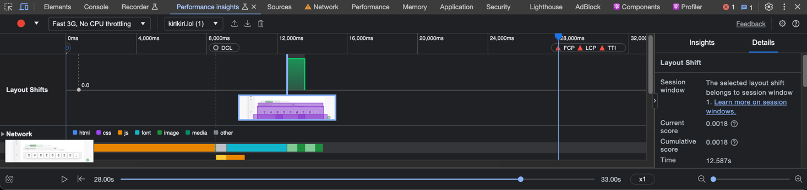
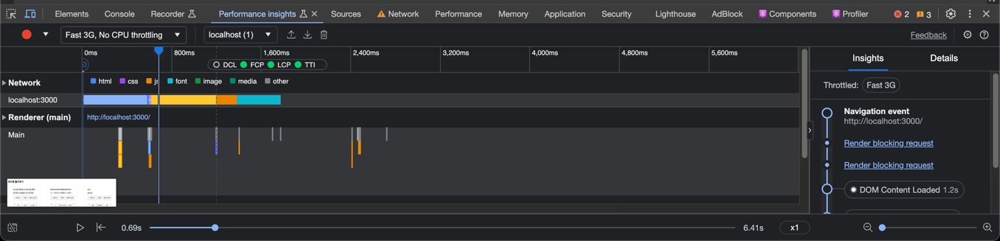

# 렌더링 시점의 비교

## SPA (Single Page Application)

### Client-side Rendering

- 페이지를 불러올 때 단 하나의 HTML 파일을 로드하고, 추가적인 컨텐츠는 JavaScript를 통해 동적으로 렌더링합니다.

- Pros: 초기 로딩 후 빠른 페이지 전환, 사용자 인터랙션이 부드러움.
- Cons: SEO 문제, 초기 로딩이 느릴 수 있음.

### SSR (Server-Side Rendering)

- Server-side Rendering
- 서버에서 페이지의 초기 상태를 렌더링하고, 해당 HTML을 클라이언트에게 전송합니다. 이후에는 SPA와 유사하게 작동할 수 있습니다.

- Pros: SEO 최적화, 초기 로딩이 빠름.
- Cons: 서버 부하 증가, 페이지 전환 시 서버 요청이 필요해 SPA보다 느릴 수 있음.

### SSG (Static Site Generation)

- Build-time Rendering
- 빌드 타임에 모든 페이지를 미리 렌더링하여 정적 파일로 생성합니다. 클라이언트는 이 정적 파일을 불러옵니다.

- Pros: 빠른 로딩, SEO 최적화, 서버 부하 감소.
- Cons: 빌드 타임이 길어짐, 동적 데이터를 다루기 어려움.

### ISR (Incremental Static Regeneration)

- Build-time + Runtime Rendering
- SSG와 유사하나, 빌드 타임 이후에도 특정 조건에 따라 새로운 페이지를 생성하거나 기존 페이지를 업데이트할 수 있습니다.

# 사용자 경험(UX) 측면 분석

## CSR

## SSR

둘다 fast 3g 환경에서 측정 후 기존 첫 화면을 보여주는데 8000ms 이상 걸렸던 CSR 방식과 달리 SSR 방식은 화면에 바로 렌더링 되는 부분을 확인했습니다. 
