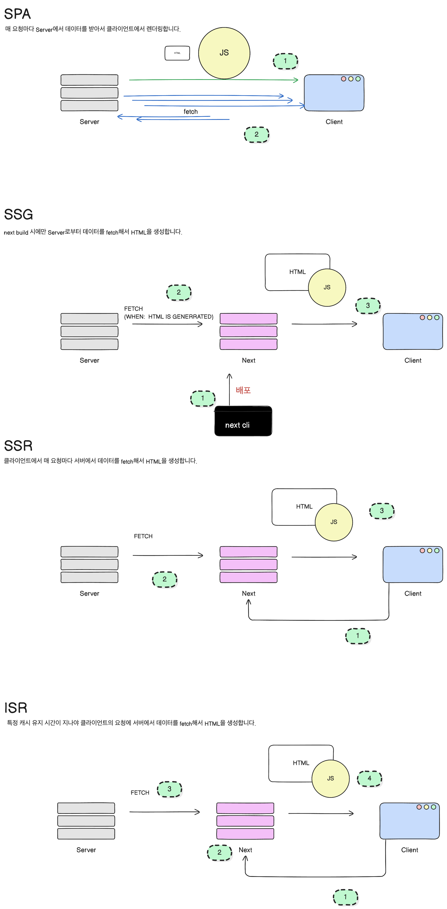
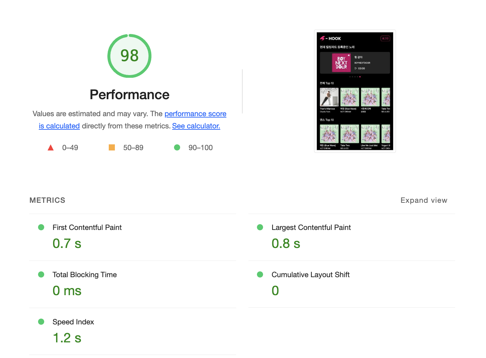
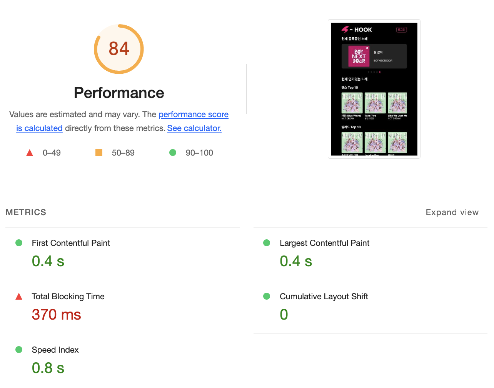
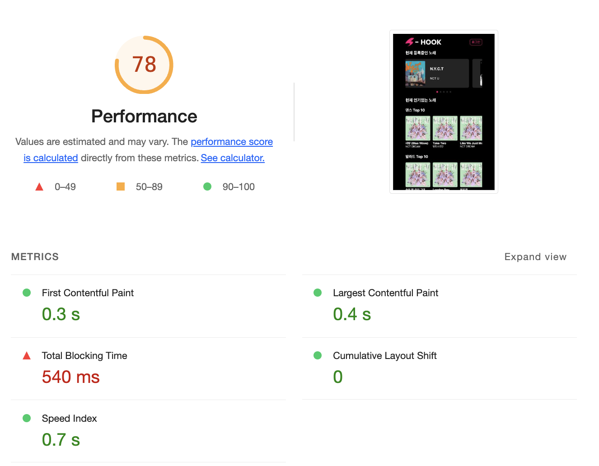

## **렌더링 시점 비교**

### SPA

1️⃣ 클라이언트에서 홈페이지에 접속하면, html 껍데기와 거대한 자바스크립트를 받습니다.

2️⃣ 거대한 자바스크립트를 순차적으로 실행하면서 브라우저에 ui를 그려줍니다. 이 때 fetch 함수를 호출하여 서버에서 데이터를 받아오고 다시 브라우저에 ui를 그려줍니다.

### SSG

1️⃣ 개발자가 레포를 Next 서버에 배포를 하면 Next가 코드를 실행합니다.

2️⃣ 코드를 실행하면서 서버로부터 데이터를 fetch해서 HTML 파일을 생성합니다.

3️⃣ 이제 클라이언트가 매번 홈페이지에 접속할 때마다, Next에서 미리 만들어 놓은 HTML 파일을 보내줍니다.

### SSR

1️⃣ 클라이언트에서 홈페이지에 접속하면, Next는 코드를 실행합니다.

2️⃣ HTML을 만들기 위해 Server에 요청을하여 데이터를 받아온 후 HTML을 생성합니다.

3️⃣ 클라이언트에 생성된 HTML을 보내줍니다.

### ISR

ISR은 SSR과 같이 Next에서 Server에 너무 많은 요청을 보내는 것을 막기 위해 생성된 HTML을 캐싱합니다. 따라서 클라이언트가 홈페이지에 접속할 때 캐싱된 HTML이 있는 지 확인하는 작업을 추가합니다.

## **사용자 경험(UX) 측면 분석**

### 페이지 서빙

SSR은 매번 Next가 서버로부터 데이터를 받아서 렌더링한 다음에 HTML을 생성하여 클라이언트에게 보내줍니다. 따라서 CSR보다 더 긴 시간동안 페이지 서빙을 하게 됩니다. 반면에 클라이언트 페이지 요청 시점에서 SSG와 ISR(서버 캐싱 만료일이 지나지 않았다면)은 이미 생성된 HTML 파일을 갖고 있기 때문에 빠르게 페이지가 서빙됩니다.

### hydration

CSR에 비해 SSR, SSG, ISR 모두 HTML 파일이 큽니다. 또한 HTML을 모두 브라우저에 그려준 다음에 JS를 실행하여 이벤트를 달아줍니다. 때문에 화면에 ui가 그려졌지만, 상호작용이 부족한 시간이 존재합니다.

### 최신자료

당연하게도, CSR, SSR은 매번 새로운 데이터를 받습니다. 하지만 ISR과 SSG는 그렇지 않습니다. 이부분에서 사용자 경험에 영향을 줄 수 있을 것 같습니다.

## **성능 측정 및 비교**

- SSG / SSR이 CSR보다 FCP 지표에서 2배가량 빠른 것으로 나타납니다. 이유는 렌더링된 HTML을 바로 그려주기 때문입니다.
- 하지만 SSG / SSR의 경우 TBT가 굉장히 큰 것으로 나타납니다. 이유는 하이드레이팅이 발생하여, HTML가 브라우저에 그려지고, JS가 실행되어 상호작용이 추가되기 까지 시간이 걸리기 때문입니다.

### SPA

### SSG

### SSR

