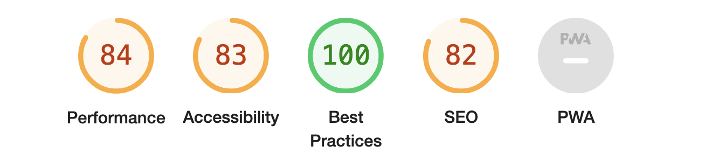
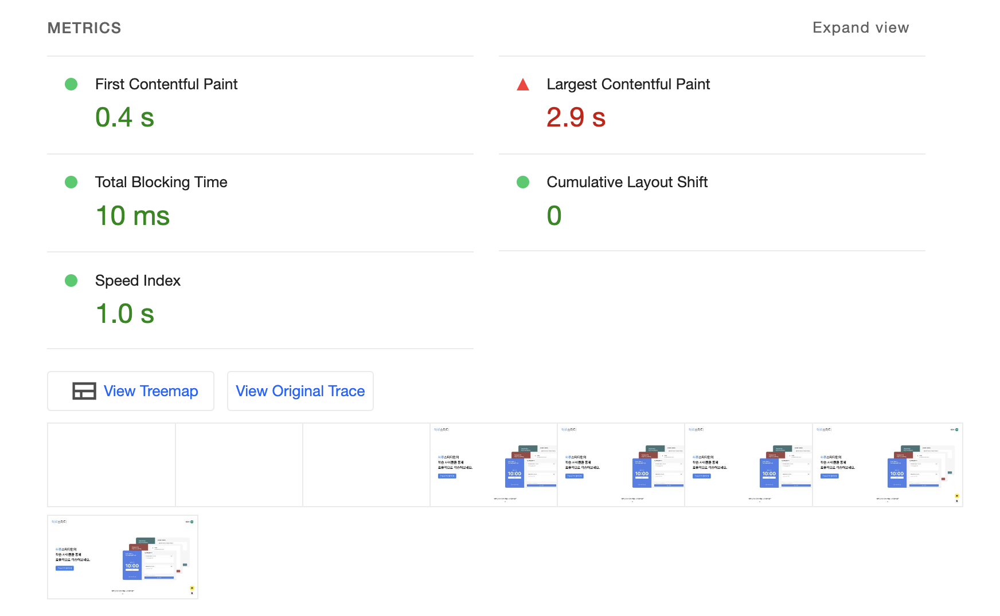
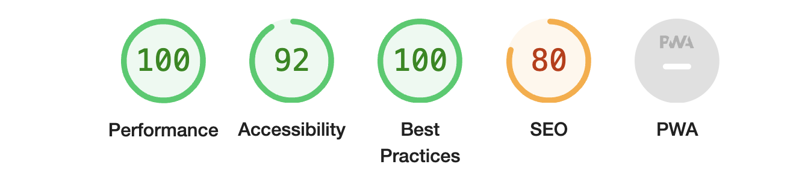
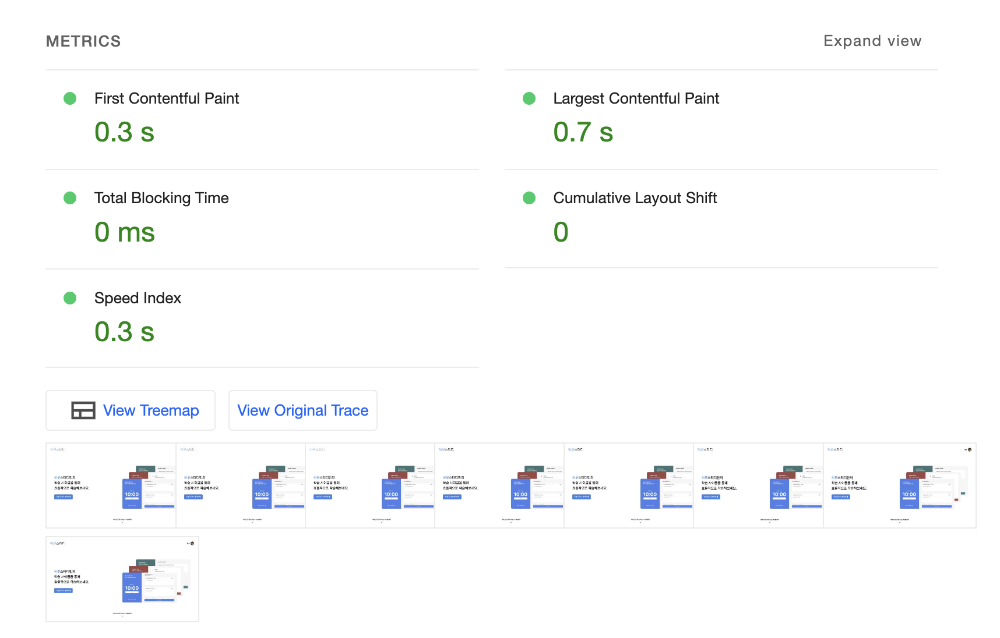

# 렌더링 방식 탐구 및 비교 분석

## 렌더링 방식 탐구

아래의 블로그로 이를 대체합니다.

[NEXT.js에서의 렌더링](https://noah-dev.tistory.com/56)

## 렌더링 비교 분석

### 사용자 경험(UX) 측면 분석

#### 랜딩페이지

정적인 페이지로 사용자와 상호작용을 하지 않습니다. 다만, 사용자의 프로필이 있으므로 해당 부분을 포함하여 SSR방식으로 렌더링을 합니다.

#### 스터디 개설 및 진행 페이지

사용자의 인터렉션이 많은 부분이므로 CSR방식으로 렌더링 합니다.

### 스터디 기록 페이지

스터디 기록 페이지는 사용자의 검색에 따라 달라지는 결과를 보여주므로 외부 요인이 존재합니다. 때문에 SSR방식으로 렌더링 합니다.

### 성능 측정 및 비교

랜딩 페이지의 light house 분석 결과

#### CSR방식의 렌더링(원본)

#### SSR방식의 렌더링(개선)

