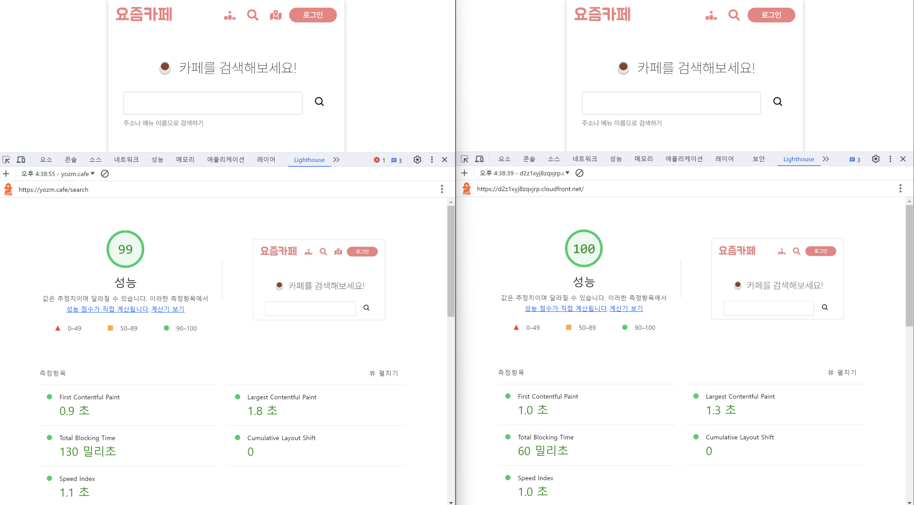
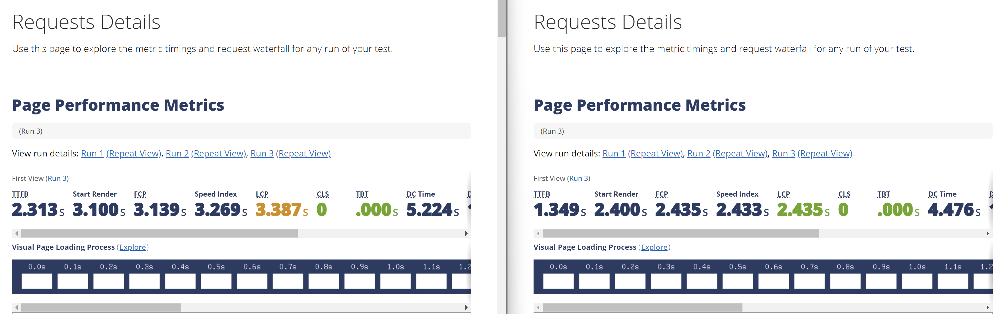

  

<h2 align="middle">프론트엔드의 렌더링 방식</h2>

내 서비스의 클론 코딩을 통해 프론트엔드 렌더링 방식 이해하기

 

## CSR (SPA)

* HTML은 본래 서버 측에서 응답하여 주는 일종의 문서였습니다.
* 시간이 흐르고 HTML을 Server-Side에서 동적으로 렌더링하여 풍부한 컨텐츠를 보여줄 수 있게 되었습니다. (PHP, JSP ...)
* 뿐만 아니라 JavaScript의 등장으로 클라이언트 측에서 동적인 처리가 가능해지고, 더 이상 문서가 아닌 인터렉티브한 애플리케이션으로 기능하기 시작하였습니다.
* 아예 화면의 렌더링 조차 클라이언트에서 수행하게 함으로서 페이지의 이동 또한 클라이언트에서 수행하게 되며 SPA(Single Page Application)의 형태를 갖추게 되었습니다.
* 서버는 클라이언트가 필요한 데이터(XML, JSON)만 응답하면 되며 View를 구성하는 책임을 온전히 클라이언트가 가지게 됩니다.
* 정리하자면, 클라이언트 측에서 JavaScript를 통해 View를 그리는 것을 CSR(Client-Side Rendering) 이라고 합니다.

## SSR

* SSR(Server-Side Rendering)은 기존의 CSR이 가지는 문제를 해결하고자 등장하였습니다.
* View의 렌더링을 클라이언트에서 수행함으로서 JavaScript 번들 사이즈가 커지고, 사용자는 페이지 접속 시 JavaScript를 모두 다운한 뒤에야 비로소 화면을 볼 수 있었기 때문에 사용자 경험을 저해하였습니다.
* 사용자가 번들을 받기 전에 화면을 먼저 볼 수 있도록 최초 렌더링 패스(Rendering Path)를 먼저 수행하여 이를 응답함으로서 번들을 받기 전 화면을 볼 수 있게끔 하는 것이 SSR 입니다.
* SSR은 CSR과 대비되는 개념이 아니며, SSR을 하더라도 CSR을 할 수 있으며, CSR 없이 SSR만 수행할 수도 있습니다. (React Server Component)
* 즉 SSR과 CSR은 상호 보완적 관계라고 할 수 있습니다.
* SSR은 일반적으로 CSR과 함께 동작하기 때문에 Universal SSR이라고도 불립니다.

## ISR

* ISR(Incremental Static Regeneration)은 SSR의 결과를 증분으로 생성하는 방식입니다.
* 클라이언트의 요청마다 SSR을 매번 수행할 필요가 없기 때문에, 렌더링 횟수를 크게 줄일 수 있습니다.
* 최신 데이터와의 불일치를 줄이기 위해 주기적으로 Regeneration을 합니다.
* SSR과 SSG 사이에 있는 균형잡힌 방식이라고 할 수 있습니다.

## SSG

* SSG(Static Site Generation)은 빌드 타임에 렌더링을 수행하고 이를 서빙하는 것을 뜻합니다.
* 완전한 SSG가 적용되어 있다면 정적 파일(html, js, css)로 빌드하여 이를 S3나 GitHub Pages 등의 정적 파일 서버에 배포할 수 있습니다.
* 주기적으로 화면의 갱신이 필요한 페이지에는 부적절하나 최초 렌더링 패스 수행 결과가 항상 동일하다면 SSG를 적용할 수 있습니다.

## 사용자 경험(UX) 측면에서 CSR vs SSR
* CSR은 번들링을 다운받은 다음에야 비로소 화면을 표시할 수 있어 LCP가 늦어집니다.
* 반면 SSR은 번들링을 받기 전 렌더링 된 index.html을 받아 화면에 표시할 수 있으므로 LCP를 낮출 수 있습니다.
* SSR은 서버 사이드에서 렌더링을 수행하기 때문에 FTTB(First Time To Byte)가 CSR보다 높게 나올 수 있습니다.
* SSR 적용시 클라이언트 측에서 번들링을 받고 hydration 과정을 거친 후 인터렉션이 가능해지는데, 이 시점을 나타내는 지표가 TTI(Time To Interactive)입니다.

## Lighthouse 비교 분석

왼쪽이 CSR, 오른쪽이 SSR 입니다.

최대한 동일한 환경을 갖추기 위해 SSG로 렌더링하고 출력된 정적 파일들을 S3, CloudFront에 업로드하였습니다.

페이지의 요소가 많지 않아 큰 차이가 나지 않을 수 있는데... LCP가 개선된 모습을 확인할 수 있습니다.

## webpagetest 비교 분석

> 미국 버지니아, 3G Fast, First View

webpagetest에서도 측정해 본 결과 LCP가 개선된 것을 확인할 수 있습니다.
