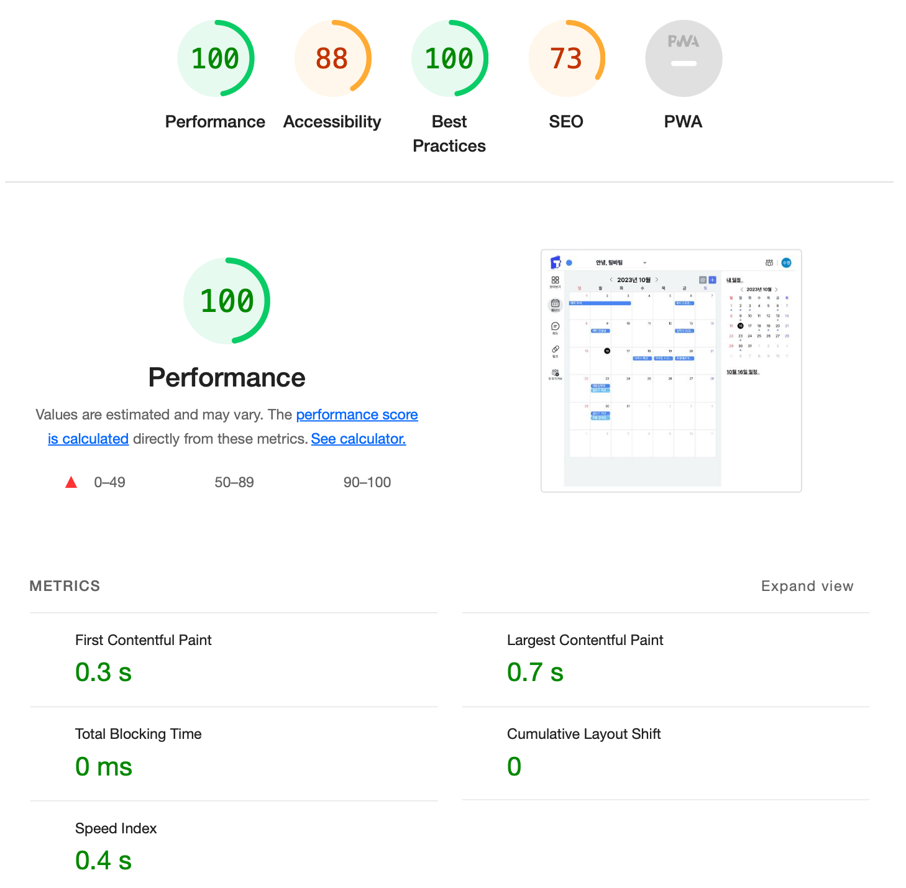
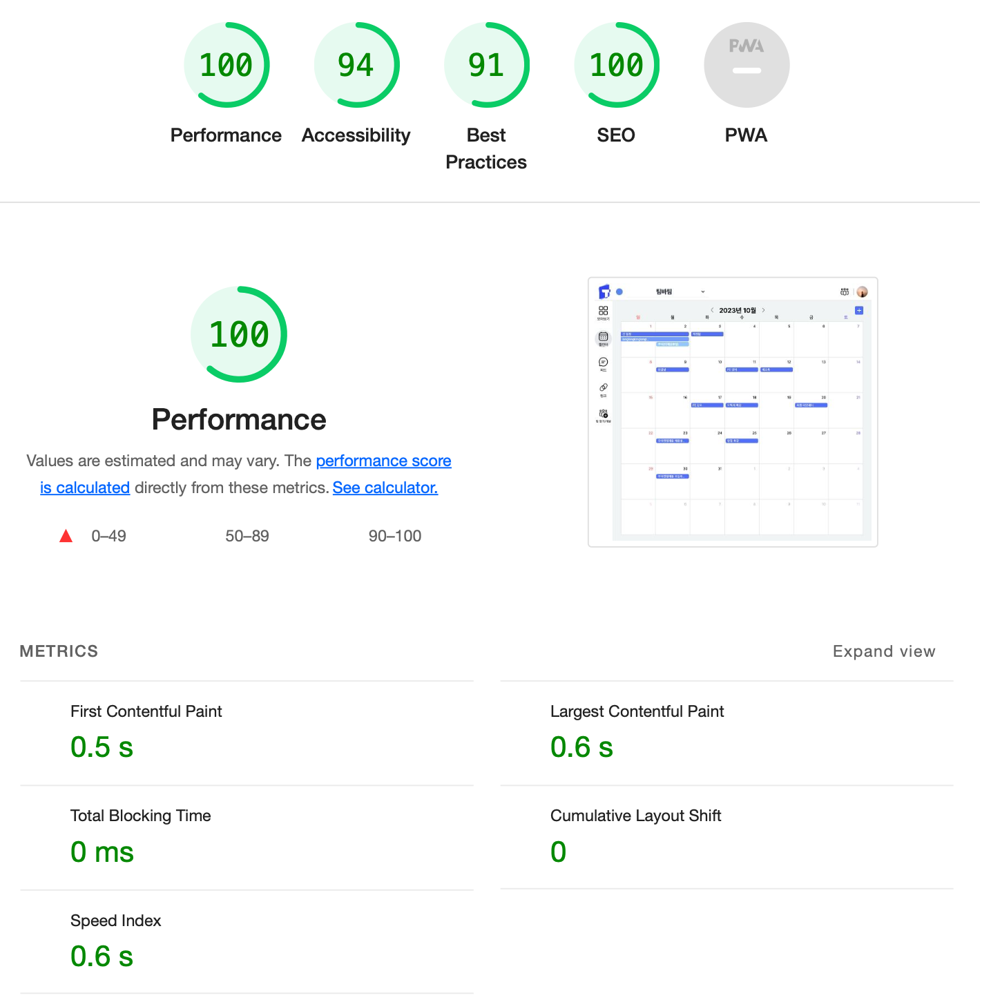
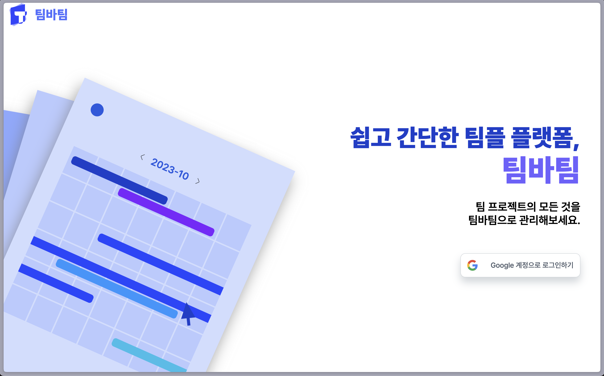

### 렌더링 시점 비교

1. SPA (Single Page Application)

- SPA는 단일 HTML 파일만을 이용해 웹을 표현합니다.
- 초기 로드 후에 페이지 갱신을 위해 js 혹은 데이터 요청을 통해 화면을 동적으로 구성합니다.
  - 초기에 필요한 HTML, CSS 및 JavaScript 파일을 한 번만 로드
- 전체 페이지를 다시 렌더링하지 않기 때문에 빠르고 부드러운 사용자 경험을 제공 가능합니다.
- 하지만 검색 엔진 최적화에 어려움이 있습니다.

2. SSR (Server Side Rendering)

- SSR은 서버에서 웹 페이지의 렌더링 요청을 받아 브라우저에 통째로 보냅니다.
- 검색 엔진 최적화(SEO)에 우수합니다.
- 하지만 옛날부터 페이지 이동 간 깜빡거린다는 문제가 있었습니다.

3. SSG (Static Site Generation)

- SSG는 빌드 시점에서 정적인 HTML을 미리 생성합니다.
- 사전에 렌더링된 페이지를 보여주기 때문에 4개의 방식 중 가장 빠릅니다.
- 다만 이미 빌드 시점에 완성되어 있어야 하기 때문에 제한적인 부분이 있는 것 같습니다.

4. ISR (Incremental Static Regeneration)

- ISR는 추가적으로 데이터를 주기적으로 혹은 조건적으로 업데이트하게 된다면 ISR 이라고 합니다.
- SSR과 SSG와 같이 사전 렌더링이 되는 것은 같습니다.
- 하지만 실시간 업데이트와 같은 방식은 어려울 수 있습니다.

### 사용자 경험(UX) 측면 분석

저희 페이지는 사용자에게 있어서 각각 다르게 보일 필요는 없지만, 주기적으로 데이터에 따라 바뀔 필요가 있다고 생각합니다.

또한 검색엔진 최적화를 통해 사용자 유입에도 신경 쓸 필요가 있습니다.

초기에는 사용자에게 있어 페이지를 빠르게 전달할 필요가 있습니다.

그래서 메인페이지의 경우 자체적으로 nextjs 에서 SSG로 파일을 보내주지 않는다면, SSR과 ISR 을 사용해야 한다고 생각합니다.

### 성능 측정 및 비교

#### 기존

#### SSR 적용 이후

네... 맞습니다.. 성능이 오히려 떨어졌어요..

기존 nextjs 에서 동작하는 방식이 가상의 로컬 공간에서 서버를 구축해 요청을 보내다보니 기존 요청보다 늦은 점도 있고, 이미지 또한 기존에는 압축과 최적화를 거치지만 nextjs 환경 앱에서는 그렇지 못하다는 점이 문제 같네요..ㅠㅜ

원래라면 TBT 에서 이득을 봐야겠지만 왜인지 기존 CSR 에서도 TBT가 0이라서 얻는 이득이 거의 없군요...

그래도 제레미는 실제 서버에 쏴서 했다고 알고 있습니다. 그 표를 한 번 공유해주셨으면 좋겠네요!

SEO 가 100점이 되었다는 것에 의의를 두어야겠군요..
