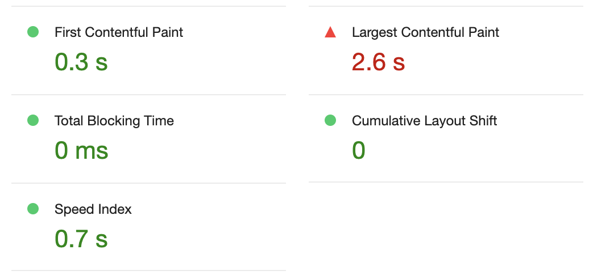

# Step2. 렌더링 방식 토론

## 렌더링 방식 분석

### 렌더링 시점 비교

- SSR 렌더링 시점

  - 사용자가 페이지에 접근할 때 서버에서 UI를 전부 렌더링하여 보내줌

- CSR 렌더링 시점
  - 서버로부터 빈 html 위에 렌더링에 관련된 내용이 js에 담겨있기 때문에 클라이언트 측에서 UI를 렌더링함.

### SPA(Single Page Application)

- ajax 도입 이전의 MPA(Multiple Page Application)와 대립되는 개념
- CSR(Client-Side Rendering)
  - 빈 html을 갖고 있기 때문에 SEO에 있어 비효율적
  - 첫 렌더링이 느림
  - 서버 부담이 적음
  - 새로고침 없이 페이지 전환 가능
- MPA와 다르게 새로운 페이지를 요청할 때 페이지 갱신에 필요한 데이터만을 받기 때문에 깜박이는 현상이 없음

### SSR(Server-Side Rendering)

- MPA의 렌더링 방식. 새 페이지를 요청하면 깜박임.
- 완성된 형태의 HTML을 서버로부터 전달받기 때문에 SEO 측면에서 효율적
- 서버 렌더링에 따른 부하가 존재할 수 있음.

### SSG(Static Site Generation)

- 빌드 시점에 페이지를 렌더링하기 때문에 정적 페이지 렌더링에 유리
- 페이지가 미리 만들어져 있기 때문에 가장 빠른 방식
- SEO에 유리
- 콘텐츠 편집이 어려움. 콘텐츠를 업데이트하기 위해서는 빌드를 다시 해야 함.

### ISR(Incremental Static Regeneration)

- SSR과 SSG가 합쳐진 방식
- 내용이 변경되어도 재배포할 필요가 없음
- 콘텐츠가 변경되어도 이전에 방문했던 페이지를 보게 되기 때문에 콘텐츠를 적절한 시점에 확인할 수 없을 수 있음.
- 콘텐츠가 동적이지만 자주 변경되지 않는 사이트에 ISR을 사용하는 것이 가장 이상적인데, 블로그나 개인 웹사이트 등이 해당됨.

## 사용자 경험(UX) 측면 분석

고객 목록 같은 경우 카페 사정에 따라 다르겠지만 플로우 상 스탬프를 적립 페이지 이후 갱신되어야하는 페이지입니다. 혹은 필터링을 통해 API 호출이 이루어지기도 하구요. 그래서 CSR+SSR이 같이 혼용되는 것이 베스트라고 생각합니다. 하지만 현재는 SSR로만 렌더링되고 있어 조금 아쉽습니다.

## 성능 측정 및 비교

프로젝트

미션

퍼포먼스 점수와 SEO 점수가 10점 내외로 향상된 것을 확인할 수 있습니다.

프로젝트

미션

특히 LCP에 있어서 아주 큰 차이를 보였습니다. 이 부분이 확실하게 SSR과 CSR의 차이가 서버에서 렌더링을 맡는지 아닌지에 따라 점수 차이가 나는 것으로 생각합니다.
