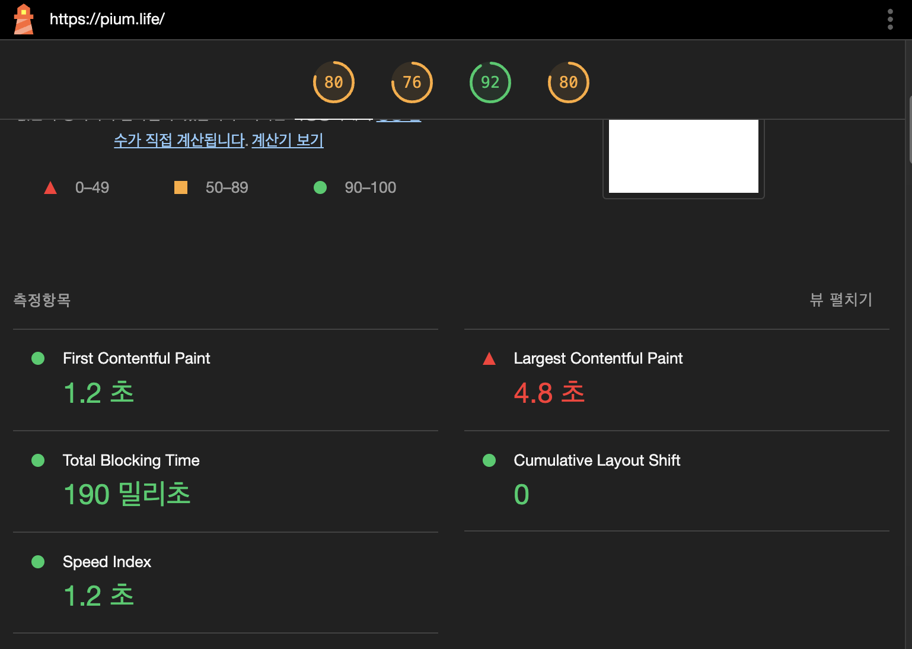
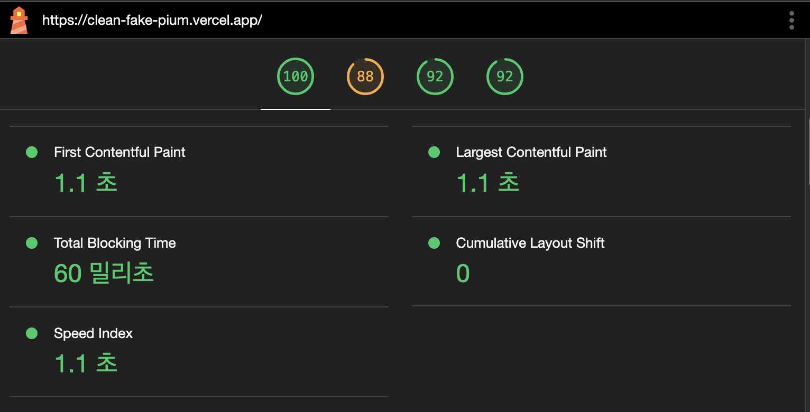
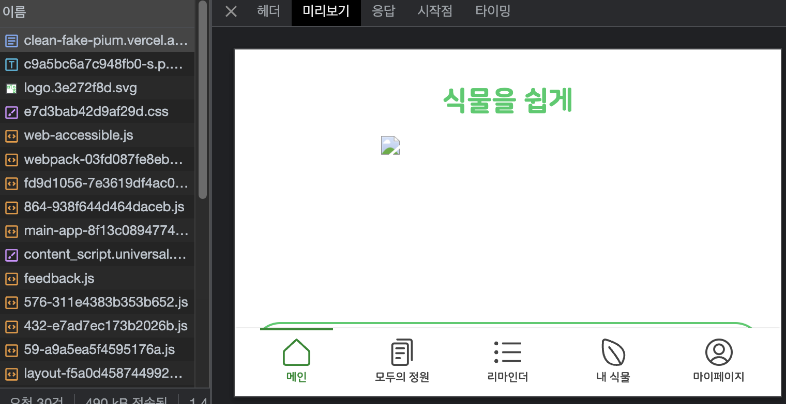

# 렌더링

## SPA

기존에 SPA인 React의 초기 렌더링은 상대적으로 시간이 좀 걸립니다. 화면이 로드되는 것이 html과 javascript를 전부 받고 렌더링 하기 때문입니다. 즉 화면이 렌더링 됐을 때 모든 인터렉션이 준비된 상태입니다. 제일 처음에 오는 HTML이 아무것도 그려지지 않은 페이지다보니 검색 엔진 최적화에 단점을 갖고 있습니다.

## SSG

저는 홈페이지는 SSG로, 리마인더 페이지는 SSR을 통해 구현했습니다.

SSG는 모든 파일을 미리 렌더링을 해놓습니다. 정적 파일에 html 을 미리 다 그려놓고, 원하는 페이지가 나오면 그대로여줍니다. 그래서 초기 렌더링 속도가 다른 렌더링 방식에 비해서 많이 빠릅니다. 하지만 브라우저 화면에서 보여줘야 하는 데이터가 최신 데이터라면 SSG로 렌더링 하는 것은 위험할 수 있습니다. 배포 당시의 데이터를 화면에 보여주기 때문에 데이터 업데이트가 자주 있는 화면이라면 SSG로 렌더링 하는 것은 지양하는 것이 좋습니다. 반면에 마크업만 보여주는 서비스인 경우에는 빠른 속도의 SSG가 이점을 갖습니다.

## SSR

SSR은 서버에서 페이지를 모두 로드해서 가져옵니다. 그렇기 때문에 검색엔진 최적화에 이점이 있고 화면 렌더링을 하고 데이터 요청을 할 필요가 없습니다. 전통적인 웹 페이지가 대부분 SSR로 이루어져 있습니다. 반면에 웹이 발전하면서 브라우저에서 많은 데이터 통신과 인터렉션이 가능해지면서 문제가 하나 생겼습니다. 바로 데이터를 최신으로 업데이트 할 때 페이지를 서버에다 새로 요청해야 하는 문제가 있었습니다. (약간 비제어 컴포넌트 같기도 하네요) SSR의 이러한 단점을 보완하기 위해 화면 업데이트 시에 깜빡임이 없는 CSR이 나타났습니다.

## 사용자 경험 측면 분석

페이지에 따라 다르겠지만, 고정된 데이터와 정적인 화면을 보여주는 페이지라면 SSG를, 초기 로딩 속도가 좀 걸리지만 한 페이지에서 사용자 인터렉션이 많은 경우라면 최적의 사용자 인터렉션 경험을 제공하는 CSR을, 인터렉션이 많이 있지않고 최신 데이터를 보여줘야 하고 빠른 속도와 SEO에 장점을 갖게 하기 위해서는 SSR을 사용하여 페이지에서 제공하고자 하는 사용자 경험을 생각하며 렌더링 하면 좋을 것 같습니다.

## 성능 측정 및 비교

SPA인 피움 사이트 입니다. CSR로 렌더링 하기 때문에 제일 처음 화면을 받아올 때 빈 화면을 받아오고, 첫 화면을 로딩해야 하기 때문에 TBT가 190ms인 것을 알 수 있습니다.

반면 SSG로 페이지를 그리는 피움 메인 페이지 같은 경우에는 서버에서부터 화면을 받아오기 때문에 미리보기에서 피움의 메인페이지가 나타남을 볼 수 있습니다. (이미지는 외부 요청이라 액박이 뜹니다…ㅎ) 아마 이미지때문에 TBT가 추가적으로 나온다고 생각이 듭니다…

하지만 같은 메인 페이지임에도 화면을 렌더링 하는 방식에 따라 첫 성능에서 차이가 존재하는 것을 알 수 있습니다.
