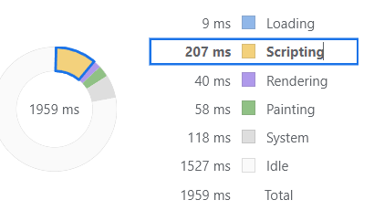
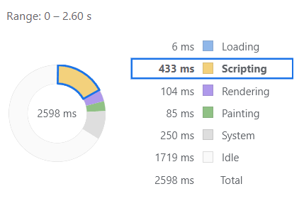

# 🎯 2단계 - 렌더링 방식 탐구 및 비교 분석

### 렌더링 시점 비교

- [x] SPA와 본인이 선택한 렌더링 방식(SSR, SSG, ISR) 중 본인이 선택한 방식간의 렌더링 시점에 어떤 일이 벌어지는지 설명 (그림 또는 다이어그램 활용도 좋습니다)

저는 ISR을 선택했었고, 이에 대해 설명하겠습니다.
랜더링 시점 이전에, **빌드 시점에** 이미 정적인 HTML이 완성되어 있습니다.
또한 app router 기준으로 fetch 함수의 revalidate 옵션에 시간을 명시하면,
해당 시간 내의 요청에는 기존에 빌드된 HTML을 제공하고,
해당 시간이 이후의 요청에는 next 서버가 가지고 새로운 HTML을 만들어서 내려줍니다.

### 사용자 경험(UX) 측면 분석

- [x] 각 렌더링 방식이 사용자 경험에 어떻게 영향을 미치는지 설명

슉을 기준으로 ISR랜더링 시 사용자는 revalidate 시간 내에는 완성된 HTML을 바로 제공 받기에 **초기 로딩 속도가 빠릅니다.**
revalidate 시간 이후의 요청에는 초기 1회, 서버의 HTML 생성을 기다립니다.

### 성능 측정 및 비교

- [x] SPA와 본인이 선택한 렌더링 방식(SSR, SSG, ISR)의 성능을 측정하고 비교 (사용한 측정 도구나 방법을 명시)

크롬 개발자도구의 Performance 탭에서 초기 로딩 과정을 측정해 봤습니다.

ISR 방식으로 이미 완성된 HTML을 받은 경우 Scripting 시간이 확실히 작습니다.

 
 

SPA 방식은 JS를 실행하여 HTML을 그리는 경우, Scripting 시간이 비교적 더 소요되는 것을 볼 수 있습니다.

### 정리

SHOOK의 메인 페이지는
동적으로 매번 새로운 페이지를 보여주지 않아도 되기 때문에, ISR을 적용하면 될것 같네요!
