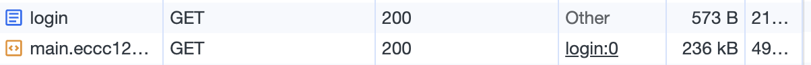

# 렌더링 방식 분석

## SPA(Single Page Application)

단일 페이지 어플리케이션 입니다. 한 페이지 내에서 자바스크립트만 이용해 요청을 보냅니다. 현재 운영 되고 있는 서비스가 이 방식으로 운영하고 있습니다. 별다른 설정(Code Spliting)을 하지 않는다면 모든 페이지를 불러옵니다. 아래는 실제 요청이 어떻게 이뤄지는지 볼 수 있습니다.

코드가 너무 커진다면 SPA에서는 초기 화면을 렌더링 되는데 오랜 시간이 걸립니다. 이는 사용자 경험에서 큰 결점이 될 수 있습니다. 따라서 이 문제를 해결하기 위해 Code Spliting을 사용할 수 있습니다.

Code Spliting이란 현재 필요없는 코드는 초기에 불러오지 않고 필요한 시점에 요청을 보내 불러오는 기술입니다. 이를 통해 초기 페이지 로딩 시간을 줄일 수 있습니다.

## SSR(Server Side Render)

사용자가 페이지를 요청시 서버에서 페이지를 그리고, 최소한의 자바스크립트만 담아 보내줍니다. 초기 렌더링 속도가 빠르다는 장점이 있고, 서버에서 미리 페이지를 그리기 때문에 SEO에 유리합니다.

다만 유저의 인터랙션이 자주일어나 데이터의 변경이 자주 일어나는 페이지라면, 이런 전략은 다소 단점으로 동작합니다. 사용자의 요청마다 잦은 요청이 일어나 서버 요청에 부담이 갈 수 있기 때문입니다.

우리 페이지에서는 어떤 부분에 쓸 수 있을까요? 바로 쿠폰 템플릿 부분인데요, 사용자인 사장님에게 우리 서비스에서 제공하는 기본 쿠폰 디자인 데이터 입니다. 이 데이터는 잘 변하지 않으며, 실시간으로 변동되는 데이터는 아니므로 서버에서 받아올 때 이전에 그려도 될 것 같다고 생각합니다.

## SSG(Static Site Generate)

빌드 타임에 컴포넌트를 통해 페이지를 그립니다. 따라서 CDN 전략에 매우 유용한 방법입니다. 빌드될 때 페이지가 완성되므로, 어떤 곳으로 뿌리든 사용자는 동일한 페이지를 받을 수 있기 때문입니다. 또한 SSR과도 같이 SEO에도 유용한 전략입니다.

우리 서비스에 적용한다면 따로 적용할 부분이 없어보입니다. 그 이유는 따로 정적인 데이터를 다루는 곳이 없기 때문입니다. 메인 플로우가 회원 쿠폰 적립이기 때문에, 거의 모든 정보가 동적입니다.

## ISR(Increment Static Render)

기본적인 동작은 서버와 동일하지만, 요청 이후 data가 stale 되었을 때 다시 그려서 보내줍니다.
즉, stale-while-revalidate 전략을 써서 데이터를 관리할 수 있습니다. 또한 데이터 일부만 변경되는 페이지만 다시 그려서 보내주기 때문에, 페이지 전체를 새로 빌드해서 보내줄 필요가 없습니다.

팀 프로젝트에서는 SSR을 사용하는 부분에서 revalidate 전략이 필요한 부분을 고민해서 적용하면 좋을 듯 합니다.
