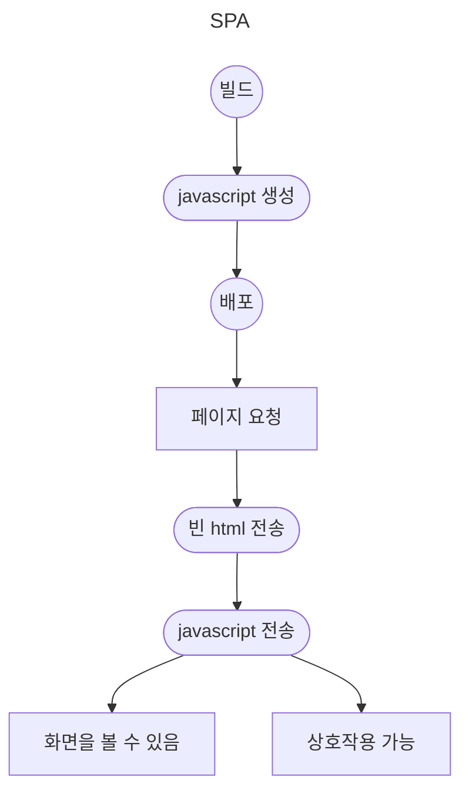
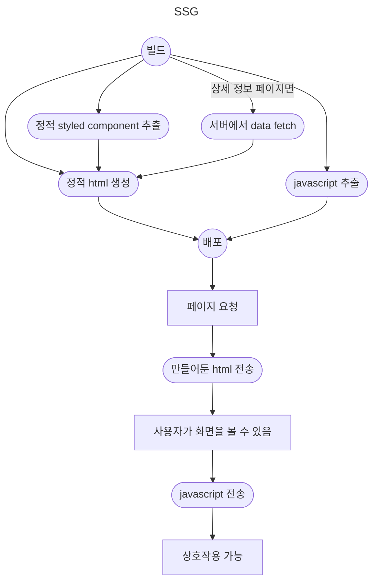
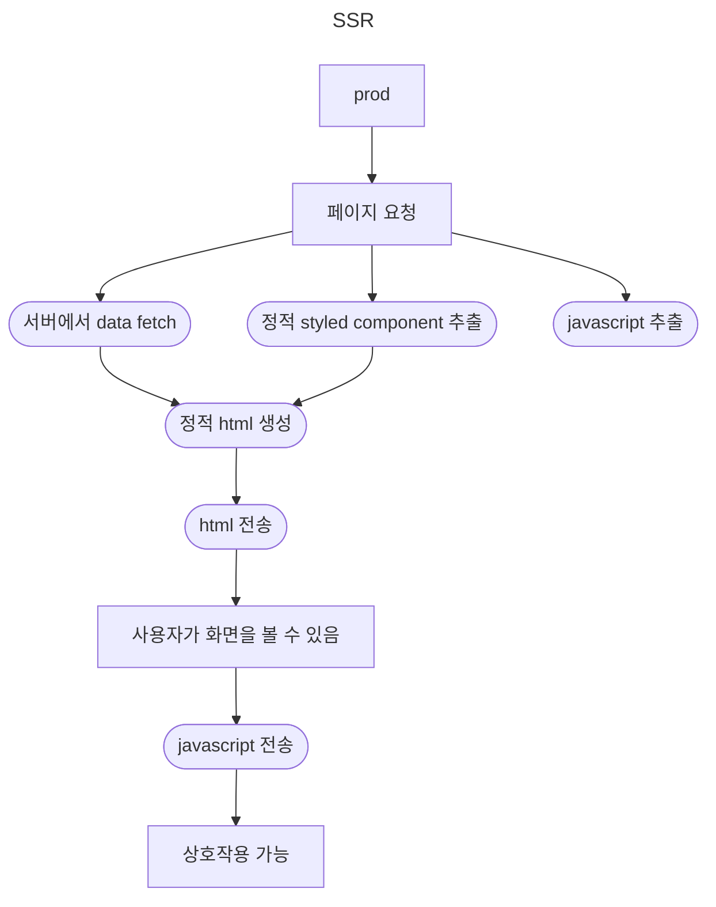

# 2단계 - 렌더링 방식 탐구 및 비교 분석

## 렌더링 시점 비교
- [x] SPA와 본인이 선택한 렌더링 방식(SSR, SSG, ISR) 중 본인이 선택한 방식간의 렌더링 시점에 어떤 일이 벌어지는지 설명 (그림 또는 다이어그램 활용도 좋습니다)

### 랜딩 페이지, 사전 식물 상세 정보 페이지

next 13버전으로 올라가면서 공식 문서가 SSG/SSR/ISR/CSR 같은 용어로부터 벗어나 Server Component와 Client Component라는 이분법 관계로 나누기 시작했더라구요. 그래서 SSG랑 SSR로 나누는 게 맞는지는 잘 모르겠습니다. 결국 SSG로 했다고 하는 이 페이지도 상호작용 때문에 자바스크립트를 받아와야 하거든요.

다만 기본적인 틀은 빌드할 떄 상호작용을 제외한 html을 싹 만들어 놓고, 사용자가 요청하면 그걸 갖다주는 형태입니다.

styled component는 작동 방식이 특이한데, next에서 빌드할 때 모든 컴포넌트를 한 번 렌더링한다는 점을 이용합니다. `ServerStyleSheet`가 렌더링 과정에서 만나는 스타일드 컴포넌트를 확인하고 정적인 애들은 `useServerInsertedHTML`를 이용해 서버가 html에 직접 넣어서 보내주는 방식이라고 이해했어요.

### 사전 식물 검색 결과 목록 페이지

이 페이지는 사용자의 요청을 받고 쿼리 스트링을 분석해서 실시간으로 html을 완성해서 보내주는 방식입니다. 빌드한 결과물을 열어보니 html 파일 자체가 처음에는 없더라구요. 정말 실시간으로 만들어서 주나 봐요.

## 사용자 경험(UX) 측면 분석
- [x] 각 렌더링 방식이 사용자 경험에 어떻게 영향을 미치는지 설명

next는 재미있게도 SSR, SSG 페이지여도 '첫 로딩'에는 html을 받아와서 이 페이지들의 강점을 살리면서 이후 페이지 이동은 전부 CSR 방식으로 자바스크립트에서 돌아가게끔 처리해서 서버 렌더링과 클라이언트 렌더링의 강점을 둘 다 챙겼습니다. 

- SSR, SSG    
사이트 첫 접속 시 일단 ui가 그려져 있는 페이지를 반환하기 때문에 사용자가 SPA에 비해 빠른 속도로 시각적인 내용을 확인할 수 있습니다. 따라서 기다리는 시간을 줄여준다는 점에서 강점을 가져갑니다. 다만 첫 ui 로딩 이후 자바스크립트를 불러오기 전까지는 상호작용은 불가능해요.
- CSR    
사이트 첫 접속 시 자바스크립트까지 몽땅 받아와야 사용자에게 화면이 나타나기 때문에 시간이 오래 걸립니다. 대신 화면이 보임과 동시에 상호작용이 가능하고, 페이지 이동도 이미 받아온 자바스크립트를 이용해서 처리하므로 반응속도가 빨라요.

## 성능 측정 및 비교
- [ ] SPA와 본인이 선택한 렌더링 방식(SSR, SSG, ISR)의 성능을 측정하고 비교 (사용한 측정 도구나 방법을 명시)

전체 페이지를 클론 코딩한 것도 아니고, 실제 피움 api와 연동한 것도 아니라서 정확한 성능 측정이 힘들 것이라 판단하어 진행하지 않았습니다.

lighthouse로 SEO 점수를 측정했을 때는 흥미롭게도 피움 개발서버와 미션 가짜 피움이 비슷하게 나왔습니다. 원인은 모르겠네요..
