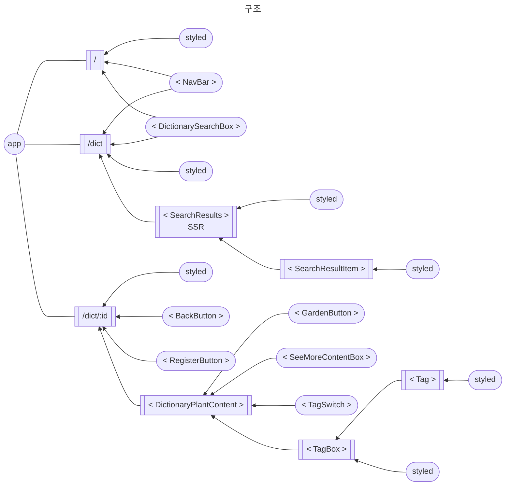

```mermaid
---
title: 구조
---

flowchart RL

landing ---- app((app))
dict ---- app
dictDetail ---- app

landingStyle([styled]) --> landing[[/]]
nav([< NavBar >]) --> landing
searchBox([< DictionarySearchBox >]) --> landing

dict[[/dict]]
dictStyle([styled]) --> dict
searchBox --> dict
nav --> dict
results[[< SearchResults > \n SSR]] --> dict
resultsStyle([styled]) --> results
resultItem[[< SearchResultItem >]] --> results
riStyle([styled]) --> resultItem

dictDetail[[/dict/:id]]
dictDetailStyle([styled]) --> dictDetail
back([< BackButton >]) --> dictDetail
register([< RegisterButton >]) --> dictDetail

content[[< DictionaryPlantContent >]] --> dictDetail
gardenButton([< GardenButton >]) --> content
seeMore([< SeeMoreContentBox >]) --> content
tagSwitch([< TagSwitch >]) --> content

tagBox[[< TagBox >]] --> content
tag[[< Tag >]] --> tagBox
tagBoxStyle([styled]) --> tagBox
tagStyle([styled]) --> tag
```