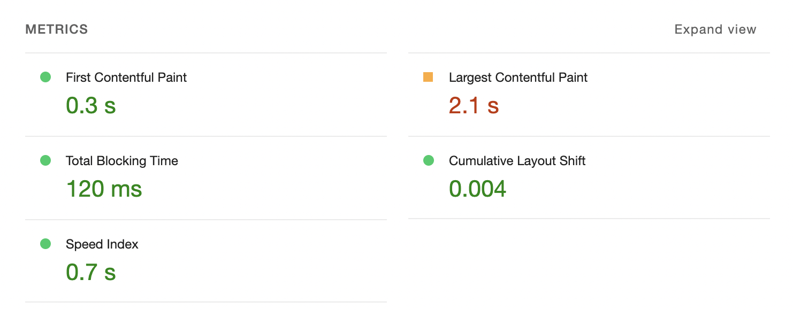
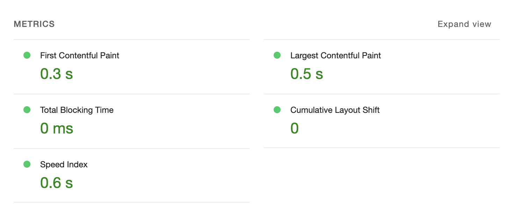

# rendering analyze report

## 렌더링 시점의 비교: 렌더링 시점에 어떤 일이 벌어지는가

### SPA (Single-Page Application)

- CSR (Client-Side Rendering) 방식을 사용.
- 최초의 빈 index.html만 존재하고, 다른 html은 존재하지 않음. interaction, 상태변화에 따라 부분적으로 re-rendering이 되어 화면 깜박임이 없고 사용성이 좋음.
- 번들의 크기가 커지면 다운로드를 받는 시간이 길어져 사용자에게 노출되는 시점이 늦어짐.

### SSR (Server-Side Rendering)

- 서버에서 제작된 html을 불러와서 그림. 때문에 더 빠르게 페이지가 사용자에게 보여진다는 장점을 지님.
- 하지만, javascript가 적용 완료되기 이전에는 UI는 존재하지만 interaction은 불가함. 때문에 TTI(Time To Interaction)이 느릴 수 있음.
- TTFB(Time To First Byte)는 CSR보다 느림. CSR는 빈 화면을 보내는 대신 SSR에서는 HTML을 생성해서 내보내야 하기 때문.
- view의 변경에 따라 서버에 재요청을 해야하므로 서버에 부담을 줄 수 있음.

### SSG (Static Site Generation)

- 준비된 페이지기 때문에 수정이 힘들지만 간단하고 빠르다는 장점을 가짐.
- SSR 방식에서 요청이 들어오는 경우 rendering이 일어나는 것과 달리 SSG 방식에선 빌드가 되는 순간에 rendering이 일어남. 때문에 사용자의 요청을 처리할 수 없으므로 정보를 내보이는 사이트에 적합.
- 서버에서 페이지를 렌더링을 하지 않는다는 SSR과 차이점이 있을 뿐 실행과정은 같음.

### ISR (Incremental Static Regeneration)

- SSG + SSR
- SSG 방식은 빌드할 때 페이지가 생성되기 때문에 데이터의 변화가 있다면 다시 빌드를 해야 한다는 단점을 지님. 이를 해결할 수 있는 방식이 일정 시간마다 페이지를 업데이트하는 ISR.
- 페이지가 요청되면 기존 캐싱된 데이터가 있는지, 있다면 오래되었는지 확인을 하여 캐시된 페이지를 전달하거나 혹은 새 페이지를 생성하여 제공.

 

## 사용자 경험(UX) 측면 분석: 각 렌더링 방식이 사용자 경험에 어떻게 영향을 미치는가

### 나의 서비스 예시

- CSR 성능지표
  
- SSR 성능 지표
  
- 여타 많은 기능을 제거하여 완전히 동일한 환경에서 실험한 것이 아니라서 정확한 지표는 아니겠지만, 그럼에도 꽤 차이가 나는 부분이 있었습니다.
  1. TBT(Total Blocking Time)
     > TBT 점수는 모바일 장치에 로드되었을 때 페이지의 TBT 시간과 TBT에 수백만 개의 실제 사이트를 곱한 값을 비교한 것 [-구글-](https://developer.chrome.com/docs/lighthouse/performance/lighthouse-total-blocking-time/)
     - 해당 TBT가 길다면 `불필요한 JavaScript 로드, 구문 분석 또는 실행. 성능 패널에서 코드를 분석하는 동안 기본 스레드가 페이지를 로드하는 데 실제로 필요하지 않은 작업을 수행하고 있음`이 일반적이라고 합니다.
     - 아마 해당 부분은 실제 서비스에서는 여타 더 많은 컴포넌트(다른 페이지)를 가지고 있고, 더 많은 기능들이 구현되어 있어 영향을 주었다고 생각합니다.
     - 일반적으로는 SSR이 CSR보다 TBT가 더 길다고 설명됩니다.
     - google에서는 200ms이내의 수치는 빠름으로 판단하고 있습니다.
     - 결과적으로 두 수치가 차이가 많이 나는 것으로 보이나 실제적으로 사용자가 느끼는 경험에는 치명적인 차이를 두지 않을 것으로 예상되며, 실제 서비스와 모의 서비스의 차이(코드량 등)로 인해 렌더링의 특징을 드러내지는 못했다고 생각됩니다.
  2. LCP(Largest Contentful Paint)
     > 뷰포트에서 가장 큰 콘텐츠 요소가 화면에 렌더링되는 시기를 측정 [-출처-](https://developer.chrome.com/docs/lighthouse/performance/lighthouse-largest-contentful-paint/)
  - LCP에 영향을 주는 요소는 아래와 같습니다.
    - `\` 요소
    - `\<svg>` 요소 내의 `\<image>` 요소
    - 포스터 이미지가 있는 `\<video>` 요소 (포스터 이미지 로드 시간이 사용됨)
    - url() 함수를 통해 로드된 배경 이미지가 있는 요소(CSS 그라데이션과 반대)
    - 텍스트 노드 또는 기타 인라인 수준 텍스트 요소 하위 요소를 포함하는 블록 수준 요소
  - SSR은 초기 로딩에 이미 렌더링된 HTML을 그리기 때문에 LCP가 좀더 빠를 수 있다고 생각됩니다.
