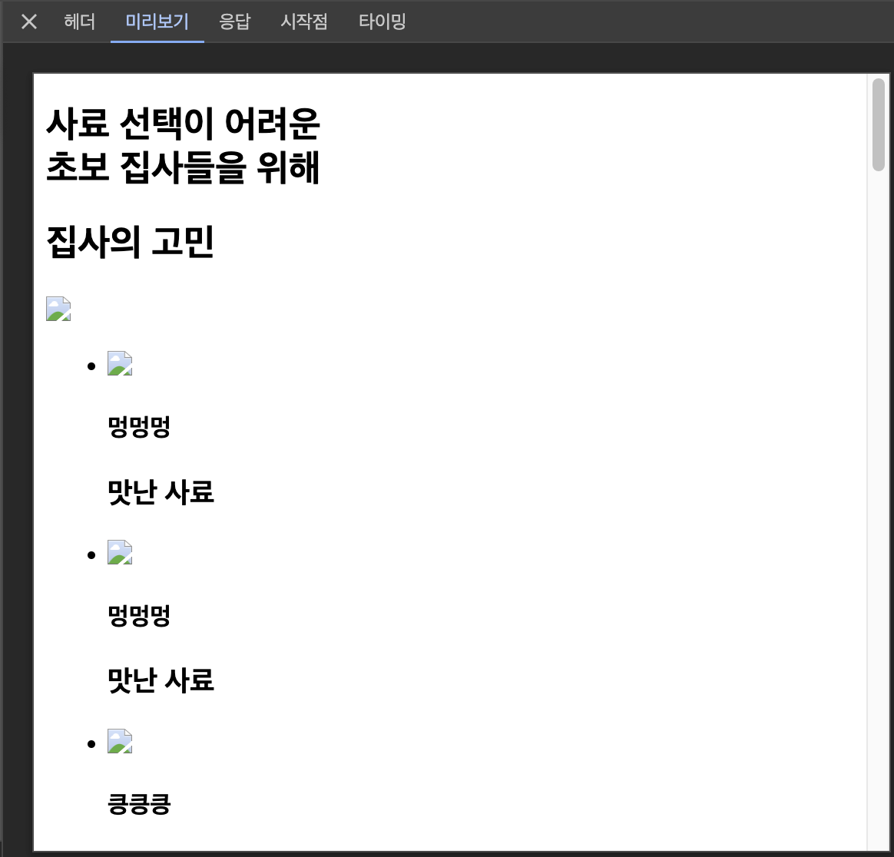

# SPA

SPA는 페이지의 초기 로딩 시 모든 리소스를 로드합니다. 따라서 최초 로딩 시간이 길다는 단점이 있으며 자바스크립트가 로드된 이후 데이터가 채워지기 때문에 SEO에 취약한 단점을 갖고 있습니다. 다만, 한번 로드 된 이후부터는 자바스크립트가 준비된 상태이기 때문에 매끄러운 사용자 경험을 제공한다는 장점이 있습니다.

# SSG

이번 미션은 SSG로 진행하였습니다.

SSG는 빌드 시점에 정적으로 HTML을 미리 생성합니다. 사전에 빌드가 완료된 페에지를 로드하기 때문에 초기 로딩 속도가 매우 빠릅니다.
다만, 이름에서 알 수 있듯이 정적으로 미리 빌드된 페이지이기 때문에 데이터의 동적이 변경이 불가능합니다.
따라서 데이터 변동이 없을 것이라 예상되는 페이지의 경우 SSG를 사용하여 빠른 로드 속도와 뛰어난 SEO의 이점을 가질 수 있습니다.

# SSR

SSR은 서버에서 초기 HTML을 생성하고, 필요한 데이터를 채운 후 이를 클라이언트로 보내줍니다. 따라서 SEO가 뛰어나고, 이후 데이터 요청마다 동적으로 업데이트하여 최신 데이터를 볼 수 있다는 장점이 있습니다. 다만, HTML을 렌더링 한 후 자바스크립트를 hydration 할 때까지의 시간 동안 사용자의 인터랙션이 동작하지 않는 단점, 라우팅 시 서버에서 새로운 페이지를 받아오는 것이기 때문에 깜빡임이 존재한다는 점 등의 단점이 존재합니다.

# ISR

ISR은 SSG와 SSR을 합친 새로운 렌더링 개념입니다. 빌드 시점에 정적 HTML을 미리 생성한 이후 동적 데이터를 주기적으로 갱신할 수 있습니다. 따라서 초기 로딩 속도가 빠르면서도 동적으로 데이터 갱신이 가능하다는 장점이 있습니다. 다만 아직까지 모든 환경에서 지원하지 않을 수 있다는 점, 데이터 갱신 주기를 세밀하게 설정해야 하는 점을 단점으로 꼽을 수 있습니다.

사용자 경험 측면 분석
페이지에 따라 다르겠지만, 고정된 데이터와 정적인 화면을 보여주는 페이지라면 SSG를, 초기 로딩 속도가 좀 걸리지만 한 페이지에서 사용자 인터렉션이 많은 경우라면 최적의 사용자 인터렉션 경험을 제공하는 CSR을, 인터렉션이 많이 있지않고 최신 데이터를 보여줘야 하고 빠른 속도와 SEO에 장점을 갖게 하기 위해서는 SSR을 사용하여 페이지에서 제공하고자 하는 사용자 경험을 생각하며 렌더링 하면 좋을 것 같습니다.

# 사용자 경험(UX) 측면 분석

이번 미션은 SSG로 진행하였습니다.
사료 목록이 미리 정해져 있고 동적으로 변경할 수 없는 데이터이기에 SSG가 적합하다고 판단했습니다.

이에 따라 사용자는 빠른 초기 로딩 속도를 경험할 수 있고 처음부터 채워져 있는 데이터를 확인할 수 있습니다.
또한 페이지가 로드되는 즉시 인터랙션도 가능하다는 장점이 있습니다.

# 성능 측정 및 비교

로드 된 html을 확인하면 데이터가 채워진 상태로 로드되는 것을 확인할 수 있습니다 😄
